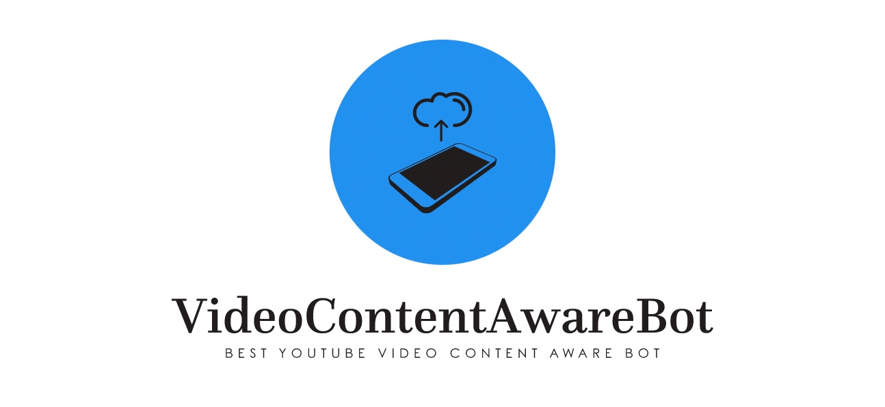

# Enable OpenAI chatbot with the selected YouTube video content using LangChain, FAISS & YouTube data-API.



## About this package

This newly solution will invoke the LangChain package to extract the transcript from the YouTube videos & then answer the questions based on the topics selected by the users. This application developed using langchain, openai, youtube data api, faiss & other useful libraries. This project is for the advanced Python developer & Data Science Newbi's.


## How to use this package

(The following instructions apply to Posix/bash. Windows users should check
[here](https://docs.python.org/3/library/venv.html).)

First, clone this repository and open a terminal inside the root folder.

Create and activate a new virtual environment (recommended) by running
the following:

```bash
python3 -m venv venv
source venv/bin/activate
```

Install the requirements:

```bash
pip install -r requirements.txt
```

Run the Main Video-scrapping-App:

```bash
python testLangChain.py
```

Please find the some of the important dependent package -

```
faiss-cpu==1.7.4
python-dateutil==2.8.2
pycaret==3.0.0
google-api-core==2.11.0
google-api-python-client==2.87.0
google-auth==2.19.0
google-auth-httplib2==0.1.0
googleapis-common-protos==1.59.0
langchain==0.0.181
numpy==1.24.3
openai==0.27.7
openapi-schema-pydantic==1.2.4
packaging==23.1
pandas==2.0.1
youtube-transcript-api==0.6.0

```

Install the above requirements.

Note that the debug indicator is set to "Y". This will generate logs. If you change this to 'N'. No logs will be generated. However, the process will be faster.

## Screenshots


## Resources

- To view the complete demo with sound, check out our [YouTube Page](https://youtu.be/EBMDSOcik4Y).
- To view on Python, check out the [Python Page](https://docs.python.org/3/).
- To view more on the LangChain, check out this [LangChain Official PyPi Page](https://python.langchain.com/en/latest/index.html).
- To view more on the OpenAI, check out this [OpenAI Official PyPi Page](https://platform.openai.com/examples).
- To view more on the Faiss, check out this [Faiss Official PyPi Page](https://faiss.ai/index.html).
